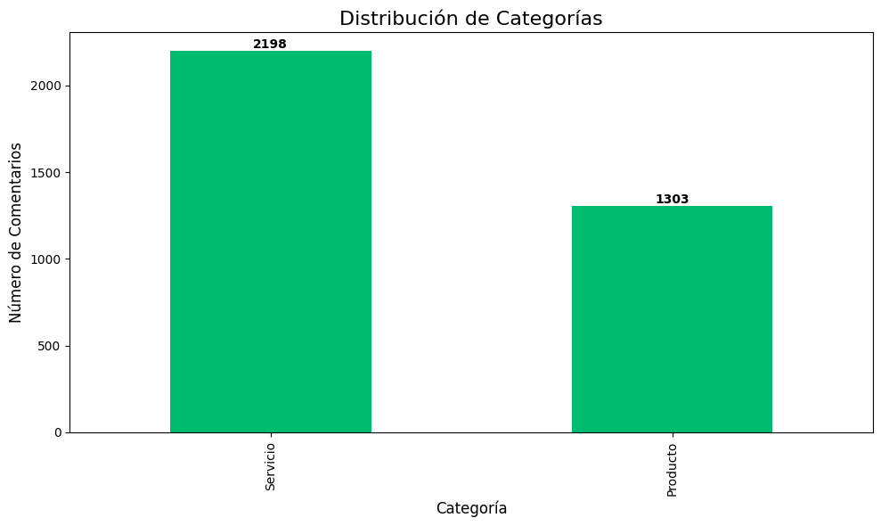
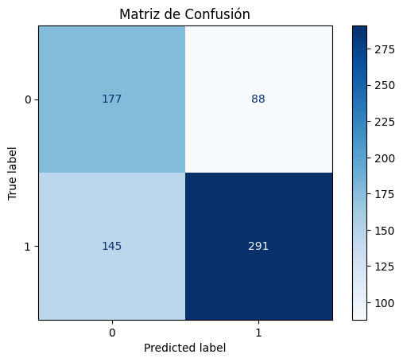
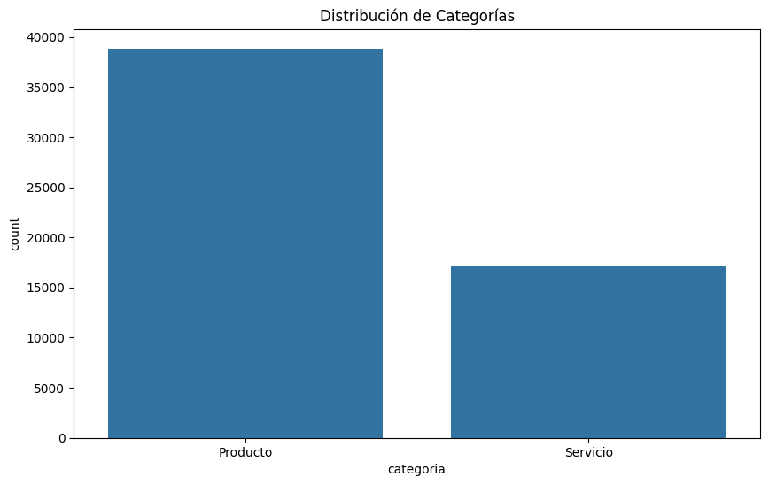
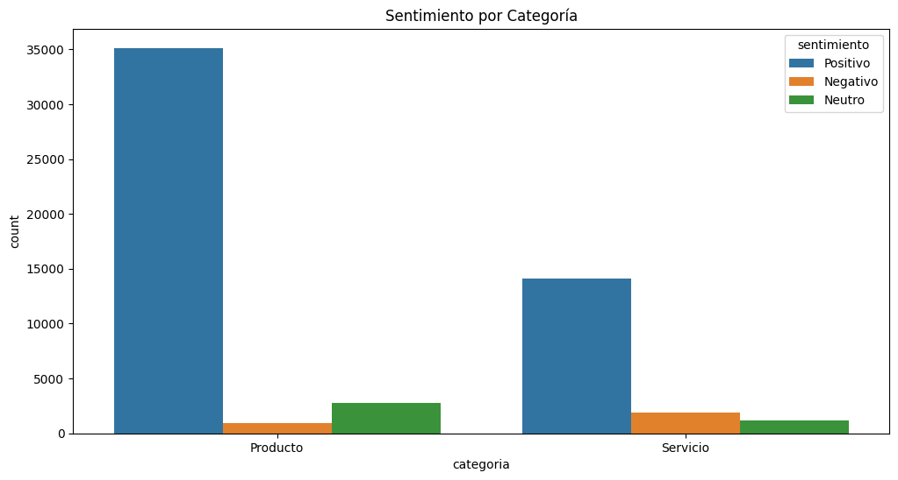
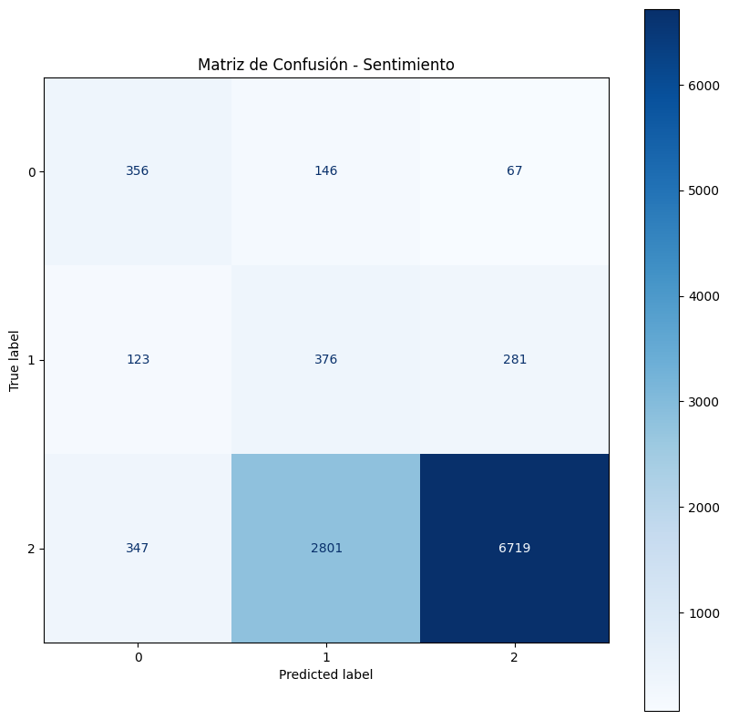
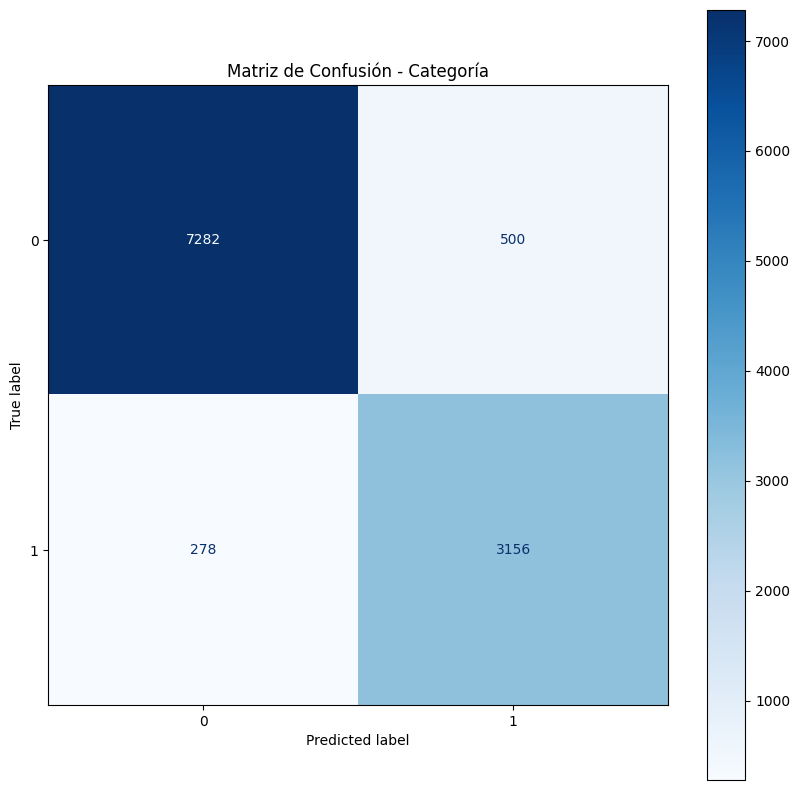

# Análisis de sentimientos

## Introducción
En el entorno altamente competitivo de las empresas que venden o alquilan aparatos POS, la retención de clientes es crucial para el éxito sostenido. Identificar cuando un cliente se quiere retirar y lograr retenerlo es una necesidad estratégica. En este caso particular es más costoso conseguir un nuevo clinete que retenerlo. Prevenir la fuga de clientes permite ahorrar recursos y poder detectar molestias de los clientes que al solucionarlos permitirán aumentar su satisfacción y convivencia con la empresa.


## Problema

En los últimos meses se ha encontrado una pérdida de clientes con tendencia creciente, que han dejado de transaccionar con la empresa, el objetivo del proyecto de tesis general es identificar los posibles fugas de clientes.
Para esto contamos con información de transacciones a nivel de red que opera y de tipo de tarjeta, así como de los casos crm.
Estos casos de atención al cliente eran el objetivo del proyecto de esta materia, poder analizar si los comentarios del cliente eran positivos o negativos.
La estructura de la data era el mensaje del usuario, junto con el motivo si era por equipo o manteniemitno o por temas administrativos o de servicio. Se consiguió una data con las mismas caracteristicas pero respecto a tiendas, para poder sustituir el dataset de las llamadas.

## Dataset

El dataset corresponde a los comentario que escriben los clientes respecto a la atencion en ciertos locales comerciales, este dataset tiene los comentarios y en ciertos casos si es sobre los productos o sobre en si el servicio, aqui lo que se hará es con los mensajes en los que se tiene la categoria del mensaje, poder entrenar un modelo para poder leer los mensajes que no tienen y completar la data, con el fin de poder conocer el mensaje asi sea bueno o malo respecto a que categoria fue.


| responseid | comentario | sentimiento | categoria |
|------------|------------|-------------|-----------|
| R_5yh7OyznCm1OQgh | Muy buena la atención | Positivo | NaN |
| R_6mx9YuxgU7Ei7v5 | Q sigan así adelante | Positivo | NaN |
| R_19p3PhMPU8C6bH2 | Sigan haciendo descuentos con diferentes produ... | Positivo | NaN |
| R_1QgI4QkBJqh26Rj | EXCELENTE ATENCIÓN | Positivo | NaN |
| R_5QFDe9k5xm3Dwxk | Ninguna. Gracias | Positivo | NaN |


## Data Analysis


Primero verificamos cuantos registros tenemos y cuantos son los que se encuentran con el registro de categoría lleno.

<div style="text-align:center">

</div>

En la gráfica podemos observar que en total de registros se tiene 56077 de los que solo 3501 corresponde a registros que nos indica si el comentario fue respecto a tema de productos o del servicio que recibieron.

### Distribución de las categorías

<div style="text-align:center">

</div>

Se observa un desbalance entre los que son producto y Servicio, por lo que habrá que buscar ese balance para el análisis
Vemos algunos ejemplos de comentarios por cada categoria.

| Categoría | Índice | Comentario |
|-----------|--------|------------|
| Servicio  | 16     | deben de cambiar a la jefa de la local y al su... |
| Servicio  | 63     | Buenas noches ayúdeme por favor últimamente no... |
| Servicio  | 103    | pésimo asesoramiento del chico flaco de la eco... |
| Servicio  | 114    | El personal es demasiado lento para la atenció... |
| Servicio  | 175    | La compra que realizaba era de $12 10 centavos... |
| Producto  | 94     | Casi nunca tienen la medicina que busco, o la ... |
| Producto  | 96     | Muestran una supuesta oferta, te cobran lo que... |
| Producto  | 122    | Todo.bien ❤️ |
| Producto  | 130    | Me vendieron un medicamento que no es, mi rece... |
| Producto  | 137    | Excelente servicio  recomendados |

### Preprocesamiento de datos
Se crea una función preprocess_text que limpia y preprocesa texto (convierte a minúsculas, elimina acentos y caracteres especiales, tokeniza, y elimina stopwords).
```
def preprocess_text(text):
    # Convertir a minúsculas
    text = text.lower()
    
    # Eliminar acentos
    text = ''.join(c for c in unicodedata.normalize('NFD', text)
                   if unicodedata.category(c) != 'Mn')
    
    # Eliminar caracteres especiales y números
    text = re.sub(r'[^a-zA-Z\s]', '', text)
    
    # Tokenizar
    tokens = word_tokenize(text)
    
    # Eliminar stopwords
    stop_words = set(stopwords.words('spanish'))
    tokens = [token for token in tokens if token not in stop_words]
    
    # Unir los tokens de vuelta a una cadena
    return ' '.join(tokens)

```
Datos preprocesados

| comentario_procesado | categoria_encoded |
|----------------------|-------------------|
| deben cambiar jefa local supervisor desposta a... | 1 |
| buenas noches ayudeme favor ultimamente envian... | 1 |
| casi nunca medicina busco incompleta precios m... | 0 |
| muestran supuesta oferta cobran aparece pagina... | 0 |
| pesimo asesoramiento chico flaco economica par... | 1 |


Se realiza el tokenizado, se crea la matriz de embedding utilizando los vectores de Word2Vec y realizamos el padding.
Y realizamos la división en train validation y test
```
from tensorflow.keras.preprocessing.sequence import pad_sequences
from sklearn.model_selection import train_test_split
from tensorflow.keras.utils import to_categorical

# Tokenizar primero
tokenizer = Tokenizer()
tokenizer.fit_on_texts(texto_con_categoria['comentario_procesado'])
sequences = tokenizer.texts_to_sequences(texto_con_categoria['comentario_procesado'])

# Actualizar vocab_size
vocab_size = len(tokenizer.word_index) + 1

# Entrenar el modelo Word2Vec con las secuencias tokenizadas
sentences = [[tokenizer.index_word[w] for w in seq] for seq in sequences]
word2vec_model = Word2Vec(sentences, vector_size=100, window=5, min_count=2, workers=4, sg=1)

# Crear una matriz de embeddings
embedding_matrix = np.zeros((vocab_size, 100))
for word, i in tokenizer.word_index.items():
    if word in word2vec_model.wv:
        embedding_matrix[i] = word2vec_model.wv[word]
    else:
        # Para palabras no en Word2Vec, usar un vector aleatorio
        embedding_matrix[i] = np.random.normal(0, np.sqrt(0.25), 100)

# Añadir padding a las secuencias
max_length = max([len(seq) for seq in sequences])
X = pad_sequences(sequences, maxlen=max_length)

```
## Class_weight
Al tener datos desbalanceados procedemos a crear una función de class_weight para poder obtener los pesos para el balanceo dentro de la LSTM.
```
class_weights = class_weight.compute_class_weight(
    class_weight='balanced',
    classes=np.unique(y_train_val.argmax(axis=1)),  # Convertimos de one-hot a etiquetas numéricas
    y=y_train_val.argmax(axis=1)
)
```
Pesos de las clases:
{0: 1.35, 1: 0.79}

## Creación del modelo

Realizamos la optimización de hiperparámetros para un modelo de red neuronal LSTM utilizando Keras Tuner. Define una función build_model que crea un modelo secuencial con capas de Embedding, LSTM y Dense, donde el número de capas LSTM, sus unidades y tasas de dropout son hiperparámetros ajustables. Utiliza el algoritmo Hyperband para buscar la mejor configuración de hiperparámetros, maximizando el F1-score en el conjunto de validación.

Teniendo como resultados


| Value | Best Value So Far | Hyperparameter |
|-------|-------------------|----------------|
| 2 | 2 | num_lstm_layers |
| 256 | 32 | lstm_units_0 |
| 0.3 | 0.3 | dropout_0 |
| 0.00092673 | 0.0046642 | learning_rate |
| 128 | 256 | lstm_units_1 |
| 0 | 0 | dropout_1 |
| 128 | 32 | lstm_units_2 |
| 0.4 | 0 | dropout_2 |
| 2 | 2 | tuner/epochs |
| 0 | 0 | tuner/initial_epoch |
| 4 | 4 | tuner/bracket |
| 0 | 0 | tuner/round |

La red neuronal está estructurada de la siguiente manera:
Capa de Embedding: Convierte los índices de palabras en vectores densos de 100 dimensiones. Usa una matriz de embedding pre-entrenada y no es entrenable.
Capa de Masking: Ignora los valores de padding (0) en los cálculos subsiguientes.
Primera capa LSTM: Con 32 unidades, retorna secuencias completas para la siguiente capa.
Capa de Dropout: Con una tasa de 0.3, ayuda a prevenir el sobreajuste.
Segunda capa LSTM: Con 256 unidades, retorna solo la salida final.
Otra capa de Dropout: Con tasa 0, efectivamente no hace nada.
Capa Dense final: Con activación softmax, produce la distribución de probabilidad sobre las clases.

Al probar con el conjunto de test tenemos los siguientes resultados


| | precision | recall | f1-score | support |
|---|-----------|--------|----------|---------|
| 0 | 0.55 | 0.67 | 0.60 | 265 |
| 1 | 0.77 | 0.67 | 0.71 | 436 |
| accuracy | | | 0.67 | 701 |
| macro avg | 0.66 | 0.67 | 0.66 | 701 |
| weighted avg | 0.69 | 0.67 | 0.67 | 701 |

Y la matriz de confusion


<div style="text-align:center">

</div>

El modelo muestra un rendimiento moderado, con una precisión global del 67%. La clase 1 ("Servicio") tiene un mejor desempeño que la clase 0 ("Producto"), con un F1-score de 0.71 frente a 0.60.
Aunque el rendimiento es aceptable se podría trabajar con el desbalance, utilizando diferentes valores en el weight_class o diferentes configuraciones en la LSTM

Una vez que tenemos el modelo procedemos a mandar como input los comentarios que no tenían categoria y tenemos los siguientes resultados:


| responseid | comentario | sentimiento | categoria |
|------------|------------|-------------|-----------|
| R_5yh7OyznCm1OQgh | Muy buena la atención | Positivo | Producto |
| R_6mx9YuxgU7Ei7v5 | Q sigan así adelante | Positivo | Producto |
| R_19p3PhMPU8C6bH2 | Sigan haciendo descuentos con diferentes produ... | Positivo | Producto |
| R_1QgI4QkBJqh26Rj | EXCELENTE ATENCIÓN | Positivo | Producto |
| R_5QFDe9k5xm3Dwxk | Ninguna. Gracias | Positivo | Producto |
| R_6aKsVnzkbXSnFEB | Sigan con la buena atención | Positivo | Servicio |
| R_6qeZi8CmkbO0Ajb | Positivo | Positivo | Producto |
| R_7IY4FcQkfVJx3nF | Tiene todo producto y el personal es amable | Positivo | Producto |
| R_7C3f0QYdsF0KPoL | Lo que no me agrada es que la factura electrón... | Positivo | Servicio |


Una vez que tenemos las dos columnas llenas procedemos a crear un nuevo modelo que nos diga si el mensaje es de que sentimiento y de que categoria, se realizaron los mismos procedimientos previos de preprocesamiento, tokenizacion y embedding.
Analizamos la distribución nueva de categorías:


<div style="text-align:center">

</div>

Observamos que ahora Producto es el que tiene mayor peso y nos va a dar un gran desbalance, pero si analizamos los sentimientos vemos que el desbalance es aún mayor


<div style="text-align:center">

</div>

Para este momento lo que se hará es trabajar con weight_class y f1 score como lo hicimos previamente, pero sería de depurar más la información que se encontraba en las encuestas, ya que el sistema que realiza estas encuestas tiene una manera peculiar de etiquetar el sentimiento.
Para un próximo análisis se recomienda usar un modelo pre-entrenado como los de Hugging Face Transformer para que analice el comentario y le coloque si es positivo, negativo o neutro.
```
from transformers import pipeline
classifier = pipeline("zero-shot-classification")

```


## Entrenamiento de la red

De igual manera se usó keras_turner para probar diferentes configuraciones e hiperparámetros dando como hasta le momento mejor configuración

| Best Value So Far | Hyperparameter     |
|-------------------|-------------------|
| 128               | lstm_units         |
| 0.1               | dropout_rate       |
| 0.00071686        | learning_rate      |
| None              | num_lstm_layers    |
| None              | lstm_units_0       |
| None              | dropout_rate_0     |
| None              | lstm_units_1       |
| None              | dropout_rate_1     |
| None              | lstm_units_2       |
| None              | dropout_rate_2     |
| 2                 | tuner/epochs       |
| 0                 | tuner/initial_epoch|
| 3                 | tuner/bracket      |
| 0                 | tuner/round        |

Se configuro esta red y se obtuvieron los siguientes resultados

### Reporte de clasificación para sentimiento:


|              | precision | recall | f1-score | support |
|--------------|------------|--------|----------|---------|
| 0            | 0.43       | 0.63   | 0.51     | 569     |
| 1            | 0.11       | 0.48   | 0.18     | 780     |
| 2            | 0.95       | 0.68   | 0.79     | 9867    |

| accuracy     |            |        | 0.66     | 11216   |
| macro avg    | 0.50       | 0.60   | 0.50     | 11216   |
| weighted avg | 0.87       | 0.66   | 0.74     | 11216   |

### Reporte de clasificación para categoría:


|              | precision | recall | f1-score | support |
|--------------|------------|--------|----------|---------|
| 0            | 0.96       | 0.94   | 0.95     | 7782    |
| 1            | 0.86       | 0.92   | 0.89     | 3434    |

| accuracy     |            |        | 0.93     | 11216   |
| macro avg    | 0.91       | 0.93   | 0.92     | 11216   |
| weighted avg | 0.93       | 0.93   | 0.93     | 11216   |

Sentimiento: El modelo tiene un buen desempeño en la 2, pero tiene dificultades significativas en las clases minoritarias, lo que sugiere que los datos están desbalanceados. COmo se menciono anteriormente, sería recomendable usar modelo preentrenados para obtener la columna se snetimiento y ahí veremos como la categoría neutral incrementa y tendremos sentimientos consistentes con los mensajes d elos comentarios. De igual manera podemos usar diferentes valores para la weight_class y seguir haciendo pruebas.

Categoría: El modelo funciona mucho mejor en esta tarea, logrando una precisión, recall y F1-score altos para ambas clases. El desempeño es mucho más consistente, lo que indica que el modelo tiene menos problemas con el desbalance en esta tarea.

Observamos que en sentimientos la matriz de confusión no es tan buena


<div style="text-align:center">

</div>

Pero en análisis de categoría si mejora:

<div style="text-align:center">

</div>


## Conclusiones

Para la sección de análisis de categoría se observó un desempeño aceptable, pero que si puede mejorar limpiando la data desde la sección de las encuestas, de igual manera probando con diferentes pesos o técnicas para el desbalanceo que es lo que un poco afecto estos resultados.
Para la segunda sección el desbalance crece demasiado en los sentimientos lo que podría mejorarse con modelos pre entrenados muy seguramente disminuye este desbalanceo y tendremos un dataset más acorde con los comentarios.

